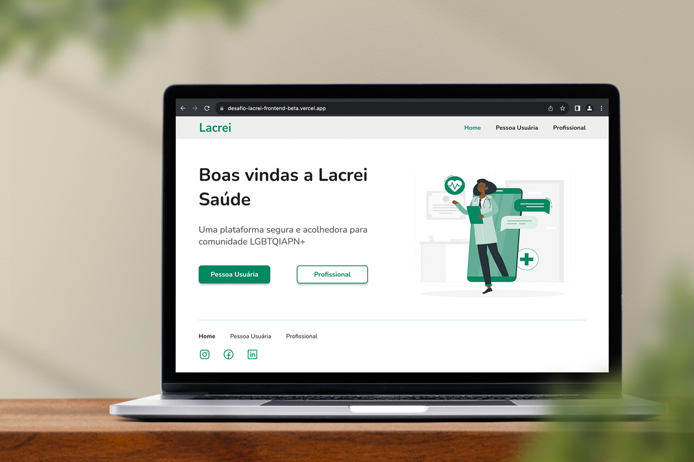

# Desafio Lacrei Front-end

 

Live preview: [https://desafio-lacrei-frontend-beta.vercel.app](https://desafio-lacrei-frontend-beta.vercel.app)

## Description

This project is a React application developed specifically for a frontend volunteering challenge, created for Lacrei, a platform serving the LGBTQIAPN+ community.

### Instructions

To run this project on your local machine, follow these steps:

1. Clone the repository to your local machine;
2. Navigate to the project directory using the command line;
3. Install the project dependencies by running the command: **npm i** or **npm install**.
4. Start the development server with the command: **npm run dev**.
5. Open your web browser and visit **http://localhost:5173** to access the application.

### Technologies

The technologies and libs used in this project include:

-  React JS
-  TypeScript
- 💅 Styled Components

---

:vulcan_salute:
